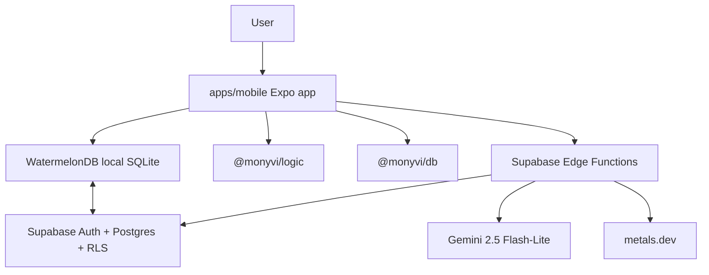
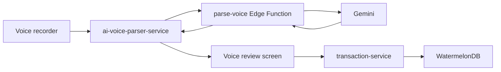

# Monyvi Technical Architecture

**Last updated:** 2026-05-20 **Status:** Implementation-aligned architecture map

This document describes how the app is currently built. The constitution remains
the authority for required engineering principles; this file explains the
implemented shape, data flows, and known architecture debt.

## 1. System Overview

Monyvi is an Expo Router mobile app backed by WatermelonDB, Supabase Auth,
Supabase PostgreSQL sync tables, and Supabase Edge Functions.



## 2. Repository Structure

| Path                  | Purpose                                                                                |
| --------------------- | -------------------------------------------------------------------------------------- |
| `apps/mobile`         | Expo Router app, screens, providers, hooks, services, validation, i18n, NativeWind UI. |
| `packages/db`         | WatermelonDB schema, migrations, models, generated Supabase types, database bootstrap. |
| `packages/logic`      | Shared calculations, parsers, currency utilities, budget utilities, analytics helpers. |
| `supabase/functions`  | Edge Functions for market rates and AI parsing.                                        |
| `supabase/migrations` | Local SQL migrations for Supabase schema changes.                                      |
| `docs`                | Business, architecture, design, process, audit, and agent documentation.               |
| `specs`               | Feature specs, plans, contracts, and mockups.                                          |

## 3. Dependency Direction

The intended dependency direction is:

```text
apps/mobile -> packages/logic -> packages/db
```

Rules:

- `apps/mobile` may import from both packages.
- `packages/logic` may import DB types only when unavoidable.
- `packages/db` must not import from `apps/mobile` or `packages/logic`.

Tracked exception: issue #654 repairs existing reverse imports from
`packages/db` model getters into `@monyvi/logic`. Those imports are allowlisted
only while the repair issue is open; they are not a pattern for new work.

## 4. App Runtime And Routing

Root runtime:

- `apps/mobile/app/_layout.tsx` initializes fonts, i18n, Sentry, notifications,
  live SMS startup handlers, auth, locale, theme, safe area, and toast
  providers.
- `SafeAreaProvider` uses `initialWindowMetrics` to avoid first-render inset
  jumps.
- Public routes are `index`, `pitch`, `auth`, and `auth-callback`.

Private runtime:

- `apps/mobile/app/index.tsx` routes signed-out users to pitch/auth and
  signed-in users to `/startup`.
- `apps/mobile/app/(private)/_layout.tsx` mounts private providers only after
  auth is resolved.
- Provider order inside private runtime is:
  `QueryProvider -> DatabaseProvider -> PrivateDataBoundary -> SyncProvider -> MarketRatesRealtimeProvider -> CategoriesProvider -> SmsScanProvider -> FirstRunTooltipProvider`.
- `apps/mobile/app/(private)/startup.tsx` is the authenticated routing gate. It
  uses initial sync state and the scoped profile to route to onboarding,
  dashboard, loading, or retry.

## 5. Local Data Model

WatermelonDB schema version is currently `17`.

Core local tables:

- `profiles`
- `accounts`
- `bank_details`
- `transactions`
- `transfers`
- `categories`
- `user_category_settings`
- `budgets`
- `recurring_payments`
- `debts`
- `assets`
- `asset_metals`
- `market_rates`
- `daily_snapshot_balance`
- `daily_snapshot_assets`
- `daily_snapshot_net_worth`

Important schema facts:

- `asset_metals` uses `purity_fraction`, not `purity_karat`.
- Market rates are USD-based rows in `market_rates`.
- Snapshot tables are pull-only/server-generated in practice.
- `bank_details` and `asset_metals` inherit ownership through parent records
  rather than storing direct `user_id`.

## 6. User-Scoped Data Access

Local rows may remain after logout, so every private read/write must scope to
the current authenticated user.

Approved helper patterns live in `apps/mobile/services/user-data-access.ts`:

- `getCurrentUserDataScope()`
- `queryOwned()`
- `findOwnedById()`
- `observeOwnedById()`
- `queryAccessibleCategories()`
- `queryChildrenOfOwnedParent()`
- `queryChildrenOfOwnedParents()`
- `assertChildRecordParentOwned()`

Components and routes must not import the raw `database` object or call
`useDatabase()` directly. Hooks may observe scoped data through approved helpers
or repositories/read models, while services own writes and workflow mutations.
Current exceptions are tracked by #655 and #657 and are allowlisted only until
those issues remove them.

## 7. Sync Architecture

Sync is implemented in `apps/mobile/services/sync.ts` with WatermelonDB
`synchronize()`.

Pull behavior:

- User-owned tables pull by `user_id`.
- Categories pull system categories plus current-user categories.
- Child tables pull through owned parent IDs.
- `market_rates` pulls recent global rows.
- Snapshot tables pull current-user rows using specialized date-based logic.

Push behavior:

- Read-only tables are skipped.
- User-owned rows are asserted to belong to the authenticated user before push.
- Child rows are validated through owned parent IDs.
- Deletes are soft deletes in Supabase.
- Supabase errors throw and fail the sync.

`SyncProvider` manages:

- Initial sync gate with timeout.
- Background refresh when a current-user profile already exists locally.
- Foreground/background sync intervals.
- Manual retry from startup recovery UI.

## 8. Auth And Session Storage

Auth is Supabase Auth.

Implemented auth paths:

- Email/password signup and sign-in.
- Email verification.
- Password reset.
- Google OAuth through browser auth session.

Session persistence uses `expo-secure-store` through a chunked storage adapter
because Supabase JWT payloads can exceed SecureStore's per-key limit.

The app does not support anonymous auth.

## 9. Layer Ownership And Attachment Pattern

Use this placement model when adding or moving code:

| Layer                                     | Responsibility                                                                                    |
| ----------------------------------------- | ------------------------------------------------------------------------------------------------- |
| `packages/db`                             | WatermelonDB schema, migrations, generated types, models, relationships, and sync configuration.  |
| `packages/logic`                          | Pure calculations, parsers, formatters, and domain utilities over plain interfaces.               |
| `apps/mobile/services` command services   | WatermelonDB writes, external clients, platform adapters, sync, auth, and workflow orchestration. |
| `apps/mobile/services` read models/repos  | Scoped local queries, joins, and display/read aggregation that should be testable outside React.  |
| `apps/mobile/hooks` and feature facades   | React lifecycle, subscriptions, loading/error/UI state, and command invocation.                   |
| Container components or route composition | Connect hooks/facades to presentational sections and own navigation/UI-only feedback.             |
| Presentational components                 | Render props and callbacks only; no raw database access, business rules, or hidden subscriptions. |
| `supabase/functions`                      | Secure network gateways for AI parsing and market-rate ingestion.                                 |

Attachment rules:

- DB models expose persisted fields and relationships. Do not attach display
  formatting, parsing, or app-specific helpers to model classes.
- Shared calculations accept plain data shapes. If `packages/logic` needs DB
  names, use `import type` or a local interface, not runtime model imports.
- Hooks should feel like React facades: subscribe, manage lifecycle state, and
  call commands. They must not own `database.write()` or multi-table business
  calculations.
- Read-model services are the home for reusable scoped reads, joins, grouping,
  and screen-specific aggregation such as budget detail, transaction timeline,
  analytics, and net-worth views.
- Components are split into containers and presentational pieces when a feature
  needs data lookup. Presentational components receive already-shaped props.
- Refactors should move one domain slice at a time with characterization tests
  first. Do not bundle the whole architecture hardening epic into one patch.

Tracked exceptions are recorded in #653-#659 and enforced through temporary
ESLint allowlists. Remove each allowlist entry in the same PR that repairs the
corresponding debt.

## 10. AI And Automation Flows

### Voice



The mobile client validates the edge-function response with Zod and maps AI
category names to local category IDs before review.

### SMS

Batch scan and live detection share the same invariants:

- Filter likely financial senders/messages.
- Hash SMS bodies.
- Deduplicate against transactions and transfers.
- Parse with AI or regex/native flow depending on path.
- Resolve account from bank details/default account.
- Save as transaction or ATM transfer.

Live Android detection is generated by the Expo config plugin
`withSmsBroadcastReceiver.js` and supports foreground/background events plus
HeadlessJS for killed-app delivery.

## 11. Backend And Edge Functions

Active Edge Functions:

| Function            | Purpose                                                                                |
| ------------------- | -------------------------------------------------------------------------------------- |
| `fetch-metal-rates` | Fetch USD-based currency and metal rates from metals.dev and insert a market-rate row. |
| `parse-sms`         | Parse batches of SMS messages with Gemini.                                             |
| `parse-voice`       | Parse voice recordings with Gemini multimodal input.                                   |

Deprecated or legacy:

- `parse-transaction` was an older OpenAI transaction parser and has been
  removed.
- Express/Vercel API endpoints are not part of the current active app
  architecture.

## 12. Validation And Error Handling

Validation patterns:

- Forms use Zod schemas in `apps/mobile/validation`.
- AI service responses are validated with Zod before mapping.
- Translation resources are validated at i18n initialization.
- Service boundaries should validate runtime inputs that can arrive from outside
  TypeScript guarantees.

Error/logging patterns:

- Use `logger` from `apps/mobile/utils/logger.ts` for production code.
- Sentry is initialized in the root layout when `EXPO_PUBLIC_SENTRY_DSN` is set.
- Error boundaries provide root and section-level recovery.
- Avoid logging raw transcripts, SMS bodies, financial notes, or parsed
  transaction payloads.
- Logger context must not include raw SMS bodies, sender names, full SMS
  fingerprints, financial amounts or balances, email addresses, full user IDs,
  account IDs, transaction IDs, transfer IDs, or payment IDs. Log event codes,
  counts, booleans, retryability, and redacted or prefix-only identifiers
  instead.

Tracked architecture debt:

- #653 repairs sensitive SMS and financial logging.
- #654 repairs package-boundary reversals between `packages/db` and
  `packages/logic`.
- #655 moves hook-owned writes into command services.
- #656 extracts read-model services from heavy hooks.
- #657 splits oversized UI modules and restores container/presentational
  boundaries.
- #659 splits sync internals into focused strategies and ownership guards.

## 13. Guardrail Rollout

Custom architecture guardrails live in `scripts/eslint-rules` and are wired
through the root lint script, mobile lint script, lint-staged, CI, and VSCode
rule paths.

Current guardrails:

- `user-scoped-db-access` requires approved scoped helper APIs for local
  WatermelonDB access.
- `monyvi-package-boundaries` prevents new package-boundary reversals.
- `monyvi-no-hook-db-write` prevents new `database.write()` calls outside mobile
  command services.
- `monyvi-no-raw-db-in-ui` prevents new raw DB access from routes and
  components.
- `monyvi-no-sensitive-logger-context` prevents new sensitive logger context
  keys.
- `max-lines` blocks new oversized source files, with generated files and
  current #657 debt explicitly allowlisted.

These rules are hard errors. Existing violations are narrow allowlist entries,
not accepted patterns. When a child issue repairs an area, remove its allowlist
entry and add or update the relevant rule tests.

## 14. Developer Workflow

Common commands:

```bash
npm install
npm run mobile
npm test -w @monyvi/mobile
npm run lint
npm run db:sync-local
npm run db:migrate
```

Database workflow:

1. Write SQL migration under `supabase/migrations`.
2. Run the appropriate local DB sync/migration script.
3. Commit migration and generated schema/type changes together.

Do not make DDL changes directly in the Supabase dashboard or through MCP tools.
